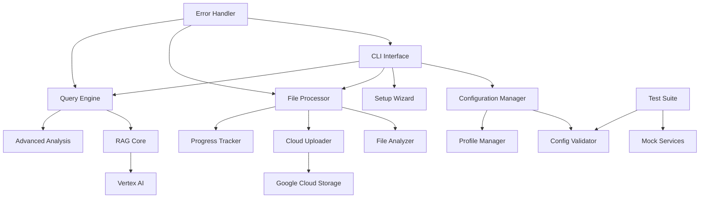

# Design Document

## Overview

This design document outlines the architecture and implementation approach for enhancing the RAG Codebase Local functionality. The enhancement will transform the existing script into a robust, production-ready system with improved user experience, better error handling, and advanced analysis capabilities.

The design follows a modular architecture that separates concerns while maintaining the simplicity and effectiveness of the original implementation. Key improvements include a configuration wizard, progress tracking, advanced query processing, and comprehensive error recovery mechanisms.

## Architecture

### High-Level Architecture



### Core Components

#### 1. Enhanced Configuration System
- **ConfigurationManager**: Centralized configuration handling
- **SetupWizard**: Interactive first-time setup
- **ProfileManager**: Multiple configuration profiles
- **ConfigValidator**: Comprehensive validation with helpful error messages

#### 2. Robust File Processing Pipeline
- **FileAnalyzer**: Intelligent file type detection and analysis
- **CloudUploader**: Resilient upload with retry logic and progress tracking
- **ProgressTracker**: Real-time progress reporting with ETA
- **FileProcessor**: Orchestrates the entire file processing workflow

#### 3. Advanced Query Engine
- **QueryProcessor**: Enhanced query handling with context awareness
- **AnalysisEngine**: Advanced code analysis capabilities
- **ResponseFormatter**: Structured response formatting
- **QueryHistory**: Track and replay previous queries

#### 4. Error Handling and Recovery
- **ErrorHandler**: Centralized error management
- **RetryManager**: Intelligent retry logic with exponential backoff
- **RecoveryManager**: State persistence and recovery mechanisms
- **DiagnosticsRunner**: System health checks and troubleshooting

## Components and Interfaces

### Configuration Manager

```python
class EnhancedConfigurationManager:
    """
    Manages all configuration aspects with validation and profiles
    """
    
    def __init__(self, config_dir: str = ".rag_config"):
        self.config_dir = Path(config_dir)
        self.profiles = ProfileManager(self.config_dir)
        self.validator = ConfigValidator()
    
    def get_config(self, profile_name: str = "default") -> RAGConfig:
        """Load and validate configuration for specified profile"""
        
    def create_config_wizard(self) -> RAGConfig:
        """Interactive configuration wizard for first-time setup"""
        
    def validate_config(self, config: RAGConfig) -> ValidationResult:
        """Comprehensive configuration validation"""
        
    def save_config(self, config: RAGConfig, profile_name: str) -> bool:
        """Save configuration to specified profile"""
```

### File Processing Pipeline

```python
class EnhancedFileProcessor:
    """
    Robust file processing with progress tracking and error recovery
    """
    
    def __init__(self, config: RAGConfig, progress_callback: Callable = None):
        self.config = config
        self.progress_tracker = ProgressTracker(progress_callback)
        self.uploader = CloudUploader(config)
        self.analyzer = FileAnalyzer(config)
    
    def process_codebase(self, path: Path) -> ProcessingResult:
        """Process entire codebase with progress tracking"""
        
    def analyze_files(self, files: List[Path]) -> AnalysisResult:
        """Analyze files for type, size, and processing requirements"""
        
    def upload_with_retry(self, files: List[Path]) -> UploadResult:
        """Upload files with intelligent retry and recovery"""
        
    def resume_processing(self, checkpoint: ProcessingCheckpoint) -> ProcessingResult:
        """Resume processing from saved checkpoint"""
```

### Advanced Query Engine

```python
class AdvancedQueryEngine:
    """
    Enhanced query processing with advanced analysis capabilities
    """
    
    def __init__(self, rag_assistant: AssistenteRAG):
        self.rag_assistant = rag_assistant
        self.analysis_engine = AnalysisEngine()
        self.query_history = QueryHistory()
        self.response_formatter = ResponseFormatter()
    
    def process_query(self, query: str, context: QueryContext = None) -> QueryResponse:
        """Process query with enhanced context and analysis"""
        
    def analyze_code_patterns(self, focus_areas: List[str] = None) -> PatternAnalysis:
        """Identify and analyze code patterns in the codebase"""
        
    def generate_documentation(self, doc_type: DocumentationType) -> Documentation:
        """Generate various types of documentation from code analysis"""
        
    def assess_code_quality(self) -> QualityAssessment:
        """Comprehensive code quality analysis"""
```

### Error Handling System

```python
class ErrorHandler:
    """
    Centralized error handling with recovery strategies
    """
    
    def __init__(self, config: RAGConfig):
        self.config = config
        self.retry_manager = RetryManager()
        self.recovery_manager = RecoveryManager()
        self.diagnostics = DiagnosticsRunner()
    
    def handle_error(self, error: Exception, context: ErrorContext) -> ErrorResponse:
        """Handle errors with appropriate recovery strategies"""
        
    def run_diagnostics(self) -> DiagnosticsReport:
        """Run comprehensive system diagnostics"""
        
    def create_recovery_checkpoint(self, state: SystemState) -> Checkpoint:
        """Create recovery checkpoint for resuming operations"""
```

## Data Models

### Configuration Models

```python
@dataclass
class RAGConfig:
    """Enhanced configuration with validation"""
    project_id: str
    bucket_name: str
    location: str = "us-central1"
    codebase_path: Path
    
    # Processing settings
    max_file_size_mb: int = 10
    chunk_size: int = 1024
    chunk_overlap: int = 256
    
    # AI models
    embedding_model: str = "publishers/google/models/text-embedding-005"
    generation_model: str = "gemini-2.5-flash"
    
    # Advanced settings
    parallel_uploads: int = 5
    retry_attempts: int = 3
    timeout_seconds: int = 300
    
    def validate(self) -> ValidationResult:
        """Validate configuration completeness and correctness"""

@dataclass
class ProcessingResult:
    """Result of file processing operation"""
    files_processed: int
    files_skipped: int
    total_size_mb: float
    processing_time: float
    errors: List[ProcessingError]
    checkpoint: Optional[ProcessingCheckpoint]

@dataclass
class QueryResponse:
    """Enhanced query response with metadata"""
    answer: str
    confidence_score: float
    sources: List[SourceReference]
    processing_time: float
    suggestions: List[str]
    related_queries: List[str]
```

### Analysis Models

```python
@dataclass
class CodeAnalysis:
    """Comprehensive code analysis results"""
    language_distribution: Dict[str, int]
    complexity_metrics: ComplexityMetrics
    dependency_graph: DependencyGraph
    code_patterns: List[CodePattern]
    quality_issues: List[QualityIssue]
    documentation_coverage: float

@dataclass
class PatternAnalysis:
    """Code pattern analysis results"""
    design_patterns: List[DesignPattern]
    architectural_patterns: List[ArchitecturalPattern]
    anti_patterns: List[AntiPattern]
    recommendations: List[PatternRecommendation]
```

## Error Handling

### Error Classification and Recovery

```python
class ErrorClassification:
    """Classify errors for appropriate handling"""
    
    RECOVERABLE_ERRORS = {
        'network_timeout': NetworkTimeoutHandler,
        'rate_limit': RateLimitHandler,
        'authentication': AuthenticationHandler,
        'partial_upload': PartialUploadHandler
    }
    
    CONFIGURATION_ERRORS = {
        'invalid_project_id': ProjectIdValidator,
        'missing_bucket': BucketValidator,
        'invalid_path': PathValidator,
        'permission_denied': PermissionValidator
    }
    
    CRITICAL_ERRORS = {
        'quota_exceeded': QuotaExceededHandler,
        'service_unavailable': ServiceUnavailableHandler,
        'invalid_credentials': CredentialsHandler
    }
```

### Recovery Strategies

1. **Network Issues**: Automatic retry with exponential backoff
2. **Rate Limiting**: Intelligent throttling and queue management
3. **Partial Failures**: Resume from checkpoint with state persistence
4. **Configuration Issues**: Interactive fixing with validation
5. **Authentication Problems**: Guided re-authentication flow

## Testing Strategy

### Test Architecture

```python
class TestSuite:
    """Comprehensive testing framework"""
    
    def __init__(self):
        self.mock_services = MockServices()
        self.test_data = TestDataGenerator()
        self.validators = TestValidators()
    
    def run_unit_tests(self) -> TestResults:
        """Run all unit tests with mocked dependencies"""
        
    def run_integration_tests(self) -> TestResults:
        """Run integration tests with test Google Cloud project"""
        
    def run_performance_tests(self) -> PerformanceResults:
        """Run performance tests with various codebase sizes"""
        
    def run_error_simulation_tests(self) -> ErrorTestResults:
        """Simulate various error conditions and test recovery"""
```

### Mock Services

```python
class MockGoogleCloudServices:
    """Mock Google Cloud services for testing"""
    
    def __init__(self):
        self.mock_storage = MockCloudStorage()
        self.mock_vertex_ai = MockVertexAI()
        self.mock_genai = MockGenAI()
    
    def simulate_network_issues(self, failure_rate: float):
        """Simulate network connectivity issues"""
        
    def simulate_rate_limiting(self, requests_per_minute: int):
        """Simulate API rate limiting"""
        
    def simulate_partial_failures(self, failure_patterns: List[str]):
        """Simulate various partial failure scenarios"""
```

### Test Data Generation

```python
class TestDataGenerator:
    """Generate test codebases and scenarios"""
    
    def create_test_codebase(self, 
                           languages: List[str],
                           file_count: int,
                           complexity: str = "medium") -> Path:
        """Generate realistic test codebase"""
        
    def create_large_codebase(self, size_mb: int) -> Path:
        """Generate large codebase for performance testing"""
        
    def create_problematic_codebase(self, issues: List[str]) -> Path:
        """Generate codebase with specific issues for error testing"""
```

## Implementation Phases

### Phase 1: Core Infrastructure (Foundation)
- Enhanced configuration management
- Basic error handling framework
- File processing pipeline with progress tracking
- Unit test framework setup

### Phase 2: Advanced Features (Enhancement)
- Advanced query engine with pattern analysis
- Comprehensive error recovery mechanisms
- Performance optimizations
- Integration testing

### Phase 3: User Experience (Polish)
- Interactive setup wizard
- Advanced documentation generation
- Performance monitoring and optimization
- End-to-end testing and validation

### Phase 4: Production Readiness (Deployment)
- Comprehensive error handling and logging
- Performance benchmarking
- Security review and hardening
- Final integration and acceptance testing

## Security Considerations

### Data Protection
- Secure handling of source code during upload
- Encryption in transit and at rest
- Proper credential management
- Access control and audit logging

### Google Cloud Security
- IAM role-based access control
- Service account best practices
- Network security configurations
- Resource isolation and cleanup

### Code Analysis Security
- Sanitization of code content before processing
- Protection against code injection in queries
- Secure handling of sensitive information in code
- Privacy-preserving analysis techniques

## Performance Optimization

### Upload Optimization
- Parallel file uploads with connection pooling
- Intelligent file compression and deduplication
- Resume capability for interrupted uploads
- Bandwidth throttling for network-constrained environments

### Processing Optimization
- Streaming processing for large files
- Intelligent chunking strategies
- Memory-efficient file handling
- Caching of processed results

### Query Optimization
- Query result caching
- Intelligent context management
- Parallel processing of complex queries
- Response streaming for large results

This design provides a comprehensive foundation for enhancing the RAG codebase functionality while maintaining the simplicity and effectiveness of the original implementation.